# Welcome to the DOTFILES!

Here lie the configuration files for some of my most extensively used programs. I hope you find some gems :D.

## nvim
An extensible text editor which I use to manipulate all text.

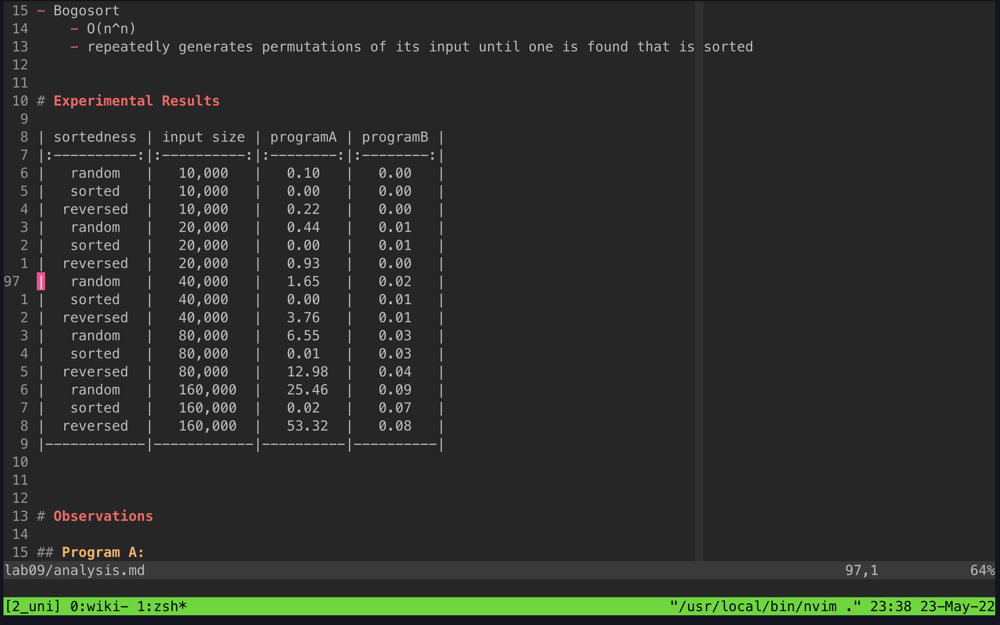

## tmux
My terminal multiplexer, without which I am lost.

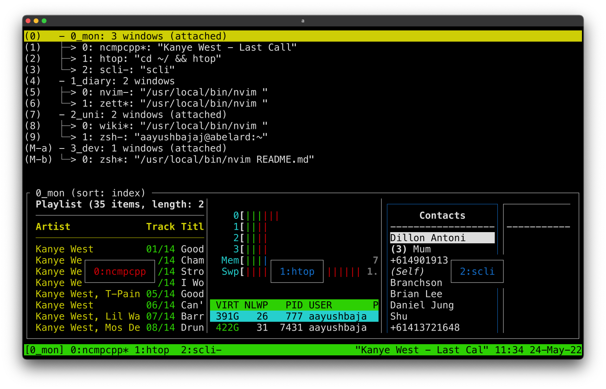

## kitty
My terminal emulator. Fast, configurable, has image preview functionality and also provides some tiling management.

Here, I am leveraging kitty's window split to keep a tmux session on the top half of my vertical monitor with the lf file manager on the bottom half. I do this because I cannot run lf with image previews in tmux.

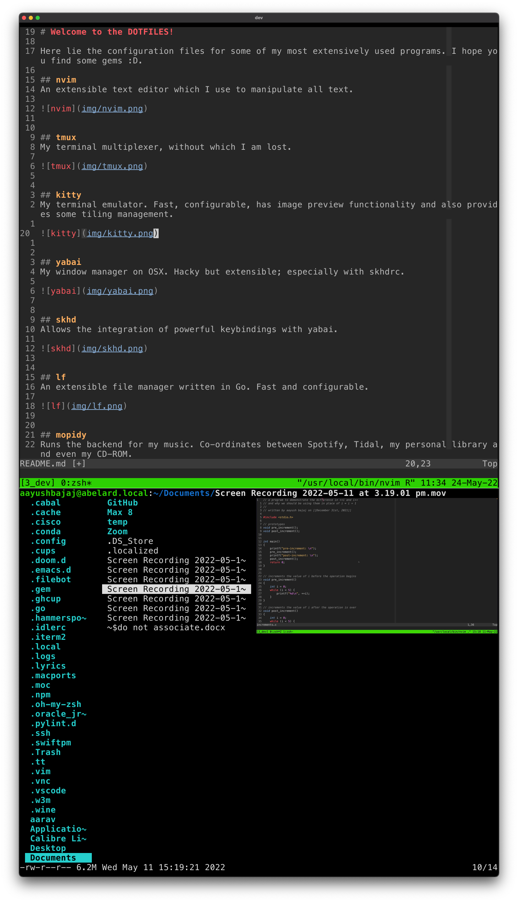

## yabai
My window manager on OSX. Hacky but extensible; especially with skhdrc.

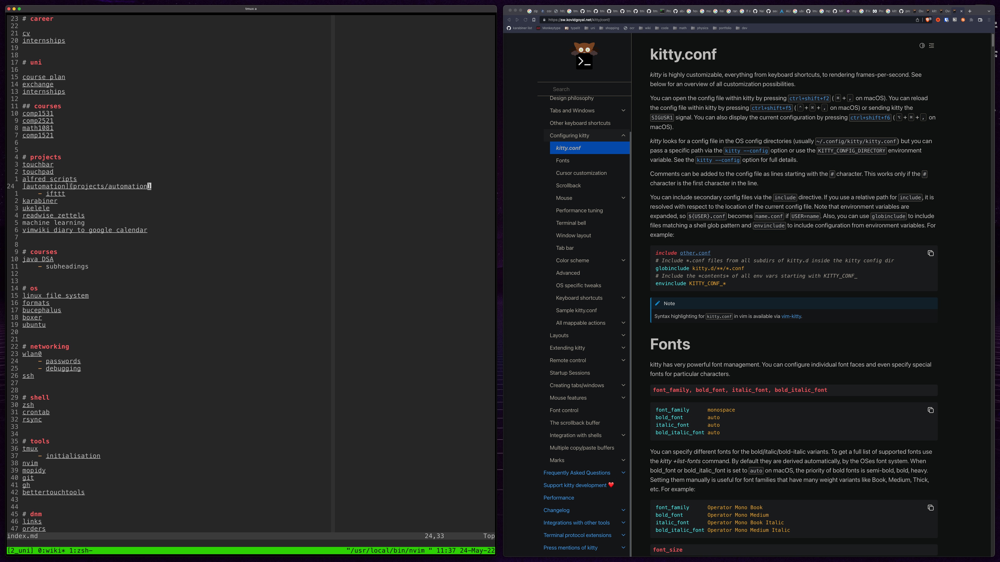

## skhd
Allows the integration of powerful keybindings with yabai.

## lf
An extensible file manager written in Go. Fast and configurable.

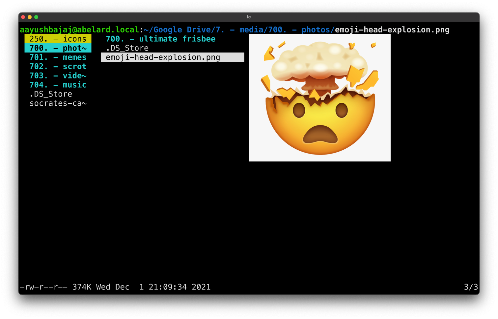

## mopidy
Runs the backend for my music. Co-ordinates between Spotify, Tidal, my personal library and even my CD-ROM.

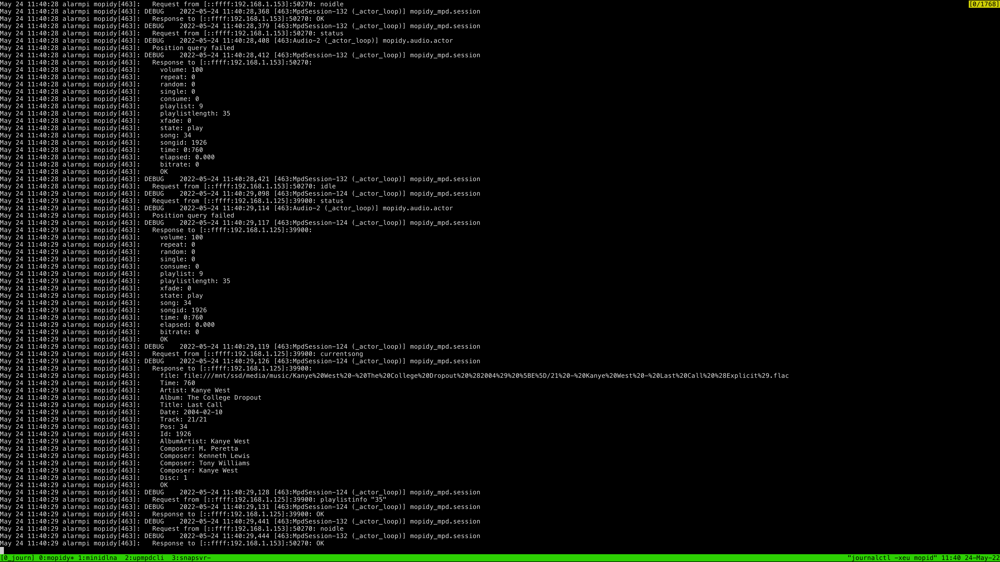

## ncmpcpp
The Terminal User Interface (TUI) client to interface with my music. Lightweight and configurable.

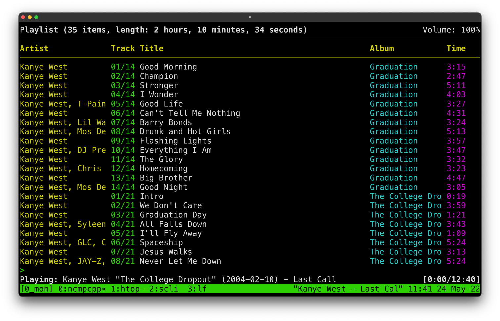

## scli
TUI for the signal messaging app. Written in Python and there is an associated overhead. Saving grace are the VIM bindings.

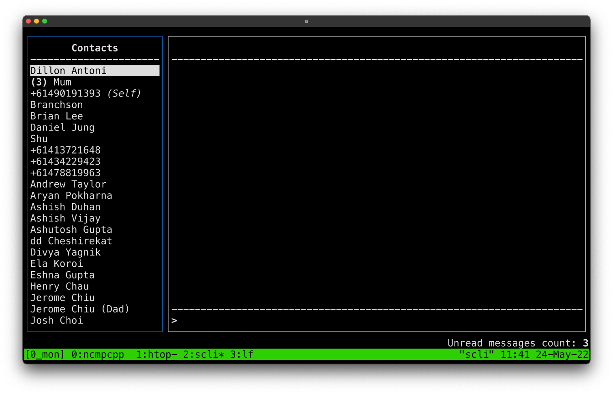

## zathura
PDF viewer with VIM bindings.

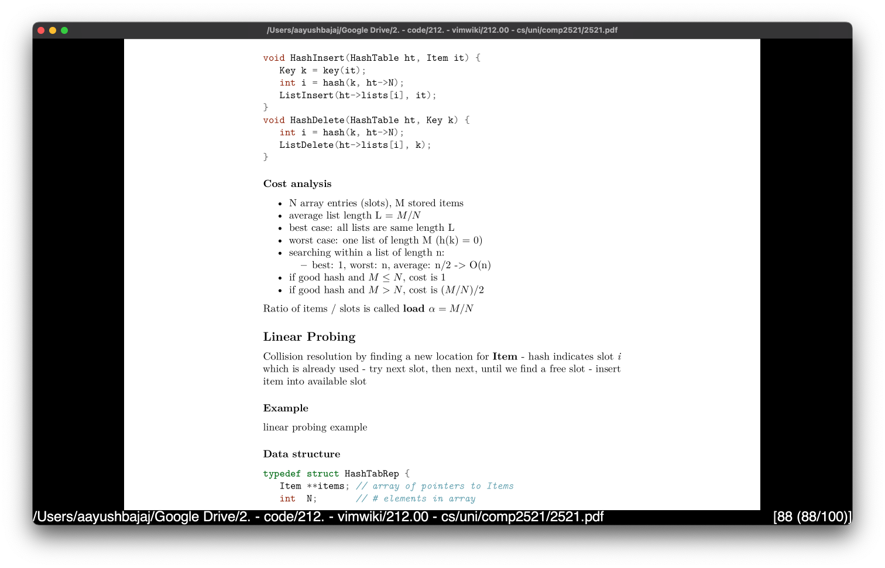

## torrentdl
Allows the indexing of magnet links from popular torrenting databases. Configured with rtorrent to receive the magnets upon selection.

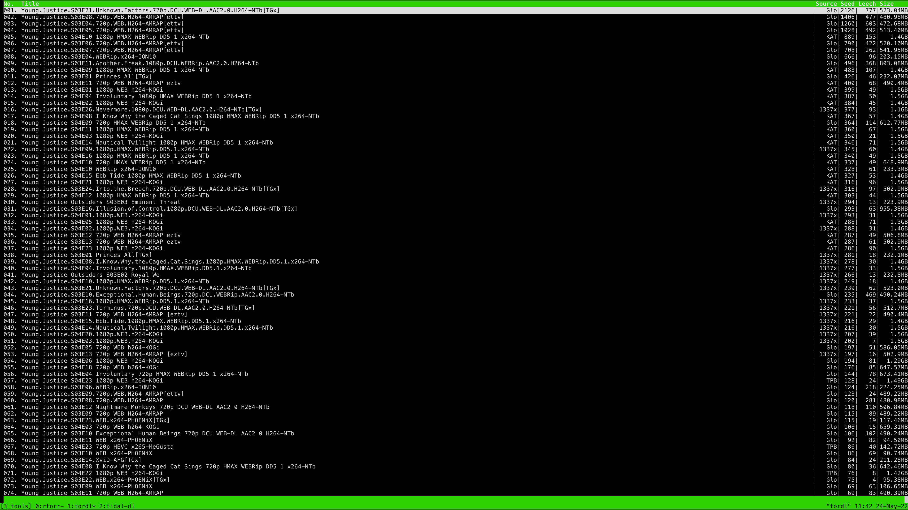

## neofetch
The cliche system information with a couple settings tweaked.

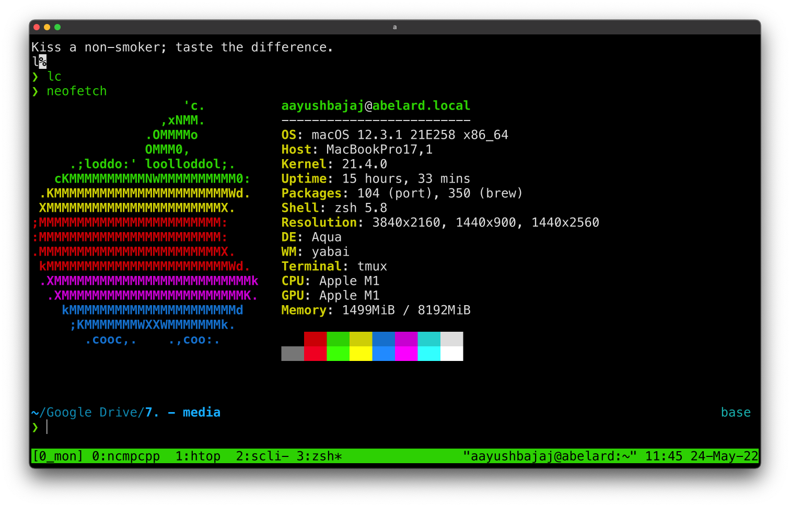

